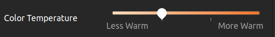

# Ubuntu Applications and Configs

## Extensions

- [Clipboard Indicator by Tudmotu](https://extensions.gnome.org/extension/779/clipboard-indicator/)

- [cpufreq by konkor](https://extensions.gnome.org/extension/1082/cpufreq/)


- [Resource Monitor by 0ry0n](https://extensions.gnome.org/extension/1634/resource-monitor/)

- [Sensory Perception by HarlemSquirrel](https://extensions.gnome.org/extension/1145/sensory-perception/)


- [Status Area Horizontal Spacing by p91paul](https://extensions.gnome.org/extension/355/status-area-horizontal-spacing/)

- [Sound Input & Output Device Chooser by kgshank](https://extensions.gnome.org/extension/906/sound-output-device-chooser/)

- [Transparent Top Bar (Adjustable transparency) by Gonzague](https://extensions.gnome.org/extension/3960/transparent-top-bar-adjustable-transparency/)

- [Rounded Window Corners by Luo Yi](https://extensions.gnome.org/extension/5237/rounded-window-corners/)


## Create Swap Partition after Installation

First create a `linux-swap` partition from Gparted.

To create a swap partition after installation, create an empty partition. It should have no holes. You can then format this partition with:

`sudo mkswap /dev/sdX`
replacing `/dev/sdX` with your partition. Mount this partition as swap with

`sudo swapon -U UUID`
where UUID is that of your `/dev/sdX` as read from this:

`blkid /dev/sdX`
Bind your new swap in `/etc/fstab` by adding this line:

`UUID=xxx    none    swap    sw      0   0`

If you want to use your swap for hibernating then you need to update the UUID in `/etc/initramfs-tools/conf.d/resume` with this content `RESUME=UUID=xxx`. Don't forget to `$ sudo update-initramfs -u`.

I assume you have a swap partition ready to use (if you have a swap file you cannot hibernate). Follow these steps:

1. Install pm-utils and hibernate:

    `sudo apt install pm-utils hibernate`

2. Then:

    `cat /sys/power/state`

3. You should see:

    `freeze mem disk`

4. Then run one of the following lines:

    ```
    grep swap /etc/fstab
    blkid | grep swap
    ```
5. Copy the UUID value. You will need it later.

6. Then run (use your favorite editor if not nano):

    `sudo nano /etc/default/grub`

7. Change the line that says:

    `GRUB_CMDLINE_LINUX_DEFAULT="quiet splash"`
    so that it instead says:

    `GRUB_CMDLINE_LINUX_DEFAULT="quiet splash resume=UUID=<YOUR_COPIED_UUID>"`
    Be careful not to miss the `UUID=` part.

8. Then, after saving the file and quitting the text editor, run:

    `sudo update-grub`

9. To test it, run:

    `sudo systemctl hibernate`

# Getting My Preferred Color (Color Accuracy)

- Download `sudo apt-get install gnome-color-manager` 

- **Go to Settings -> Color -> Laptop Screen -> Add Profile -> Select Standard Space - sRGB**

- Night Light

    