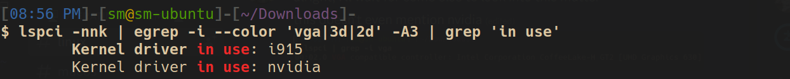
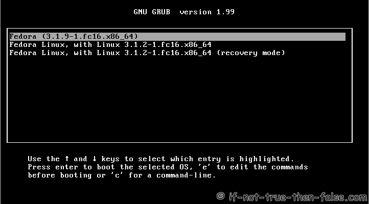
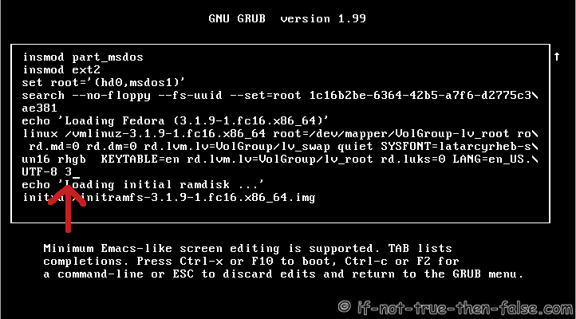

# Useful Commands for Ubuntu

### For some commands on the internet you copy once and then forget where you copied it from. (^*Always understand the command before running it*)

- ## To see which graphics drivers are in use.

    `lspci -nnk | egrep -i --color 'vga|3d|2d' -A3 | grep 'in use'`


    

- ## Switching betwen GUI and text-mode

    ### Switch while Ubuntu is running
    Switch to "text mode" (you can simply run this in e.g. gnome-terminal):

    `sudo systemctl isolate multi-user.target`
    
    Switch to "graphical mode":

    `sudo systemctl isolate graphical.target`

    ### Set boot target
    You can set the default target that is reached after boot (persists across reboot), e.g.:

    `sudo systemctl set-default multi-user.target`
    
    You can also set a target with the kernel parameter systemd.unit, e.g.

    `systemd.unit=multi-user.target ` 

    Source [askubuntu](https://askubuntu.com/questions/1242965/how-to-disable-gui-in-ubuntu)  

    - ### Runlevels
    ```
    0 – Halt Shuts down the system.
    1 – Single-User Mode Mode for administrative tasks.
    2 – Multi-User Mode Does not configure network interfaces / services.
    3 – Multi-User Mode with Networking Starts the system normally.
    4 – Not used/User-definable For special purposes.
    5 – Start the system with display manager. As runlevel 3 + display manager.
    6 – Reboot Reboots the system
    ```

     **How to change runlevel on GRUB**

     1. Press arrow key when you see GRUB. Select (highlight) kernel to edit and press ’e’

     

     2. Goto ’linux’ line with arrow keys, then press ’end’ button to get end of line (or move cursor to end of line with arrow keys). Write space and your runlevel number end of line. Here I use runlevel 3.

     

     Source: [if-not-true-then-false.com](https://www.if-not-true-then-false.com/2012/howto-change-runlevel-on-grub2/)