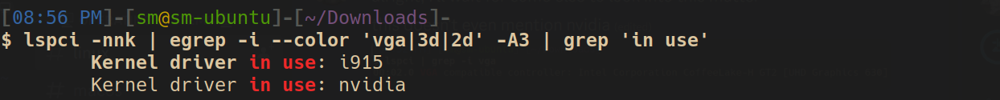

# Useful Commands for Ubuntu

### For some commands on the internet you copy once and then forget where you copied it from. (^*Always understand the command before running it*)

-  To see which graphics drivers are in use.

    `lspci -nnk | egrep -i --color 'vga|3d|2d' -A3 | grep 'in use'`

    